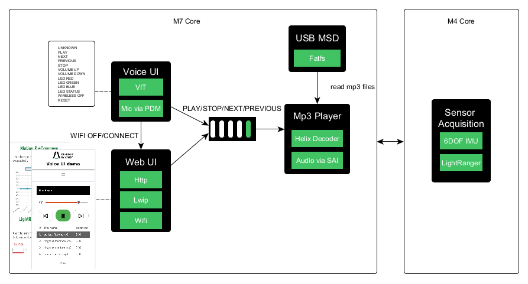
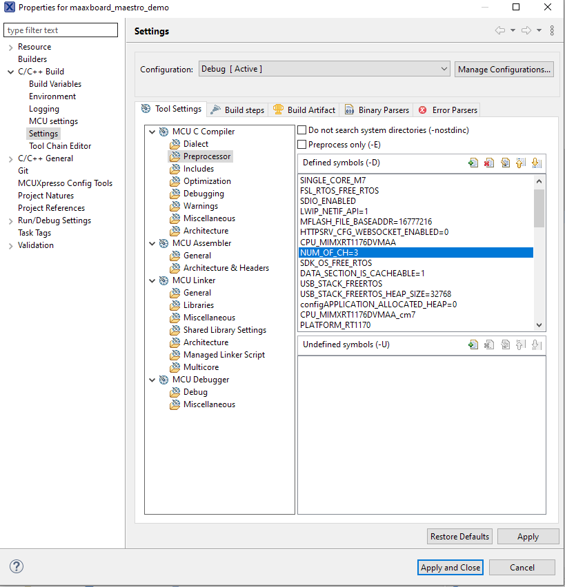
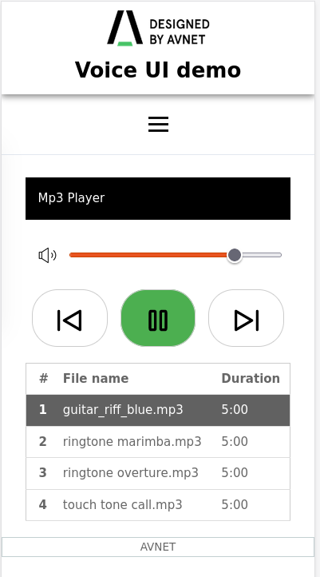
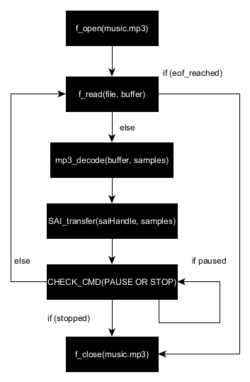
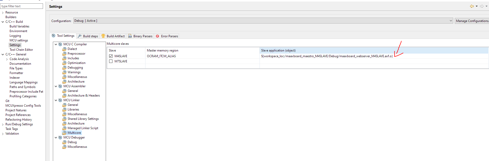

# VIT GUI demo
# Overview
This is multi-core project demonstrates **Voice Intelligent Technology** from NXP along with several extra features. The Demo consists of 2 projects.
* maaxboard_maestro_M7MASTER
* maaxboard_maestro_M4SLAVE

Application features are partitioned into projects as below.
* lwip webserver (Master)
* Voice control (Master)
* Mp3 Player (Master)
* IMU, Light ranger sensor acquisition (Slave)

**Table of Contents**
1. [Porting Maestro demo](#Porting-Maestro-demo)
2. [Voice UI](#voice-control)
3. [Web UI](#webserver)    
4. [MP3 Player](#mp3-player)
5. [Sensor Acquisition](#sensor-acquisition)
6. [Attaching M4 project](#attaching-M4-project)
<figure>

<figcaption>Overview diagram for the Demo</figcaption>
</figure>

# Porting Maestro demo
### Following changes have been made on the maestro_demo example to port to MaaXBoard.

**1. Pin Configuration**
</br>Use SAI2 instead of SAI1 connection.

| signal   | physical pin | peripheral  |
|----------|--------------|-------------|
| MCLK     | N15          | SAI1  |
| TX_DATA0 | K14          | SAI1  |
| TX_SYNC  | J12          | SAI1  |
| TX_BLK   | K12          | SAI1  |
| RX_DATA0 | K13          | SAI1  |

to

| signal  | physical pin | peripheral  |
|---------|--------------|-------------|
| MCLK    | M1           | SAI2  |
| TX_DATA | P1           | SAI2  |
| TX_SYNC | R2           | SAI2  |
| TX_BLK  | N2           | SAI2  |
| RX_DATA0| --NA--       | --NA--|

*Note: MaaXBoard uses PDM peripheral for mic input. So SAI2 RX_DATA signal is not necessary.*

**2. Audio codec**
MaaXBoard uses SGTL5000 audio codec. NXP sdk already provides the driver for this codec. The driver files are placed in following locations.

* `/codec/port/sgtl5000/fsl_codec_sgtl_adapter.c/h`
* `/codec/fsl_sgtl5000.c/h`

And following codec configurations is added in main.c file.
```
codec_handle_t codecHandle   = {0};
/* codec config */
sgtl_config_t sgtlConfig = {
	.i2cConfig        = {.codecI2CInstance = BOARD_CODEC_I2C_INSTANCE, .codecI2CSourceClock = BOARD_CODEC_I2C_CLOCK_FREQ},
	.route            = kSGTL_RoutePlaybackandRecord,
	.bus              = kSGTL_BusI2S,
	.slaveAddress     = SGTL5000_I2C_ADDR,
	.format           = {
			.mclk_HZ       = 24576000U,
			.sampleRate    = 44100U,
			.bitWidth      = 16U
	},
	.master_slave     = false,
};

codec_config_t boardCodecConfig = {.codecDevType = kCODEC_SGTL5000, .codecDevConfig = &sgtlConfig};
```

**3. Mic audio sample acquisition via PDM**
</br>VIT configures microphone in following way:
* 16khz sample rate
* 16bit signed
* single channel (mono)

</br> Initialization of PDM peripheral and its corresponding DMA channel are placed in the following files.
* `source/main.c`
* `source/streamer_pcm.c/h`

Inside streamer_pcm.c file, 
* `void streamer_pcm_init(void)` - configures the PDM, DMA, and interrupts.
* `pcm_rtos_t *streamer_pcm_rx_open(uint32_t num_buffers)` - create DMA handle for PDM transfer, sets the channel and pdm callback. *Note: Currently left microphone on bitstream0 is used.*
* `int streamer_pcm_read(pcm_rtos_t *pcm, uint8_t *data, uint8_t *next_buffer, uint32_t size)` - received PDM data is copied to VIT buffer pointed by `data` pointer.

PDM creates the 32bit sample data stored in the `s_buffer`. It has size of (160samples * 2 * 4) bytes. It stores 2 full 32bit 160 samples. It continuously fills up the buffer. when 160 samples are captured, This data will be copied to VIT stream buffer.

PDM creates 24bit signed data. MSB byte is 0x00, so it can be ignored. Following code in `streamer_pcm.c` converts the received Interleaved PDM signals in buffer to 16bit deinterleaved signals and copy to VIT stream buffer.
```
    /*
     * convert to 16bit samples and de-interleave the multi-channel samples like
     * A1, B1, C1, A2, B2 ... => A1, A2, A3, .. B1, B2,...
     */
    DeInterleave((uint8_t *)&(pdmXfer[buffer_index ^ 1].data[0]), data, 160, NUM_OF_CH);
```
Following gain configuration seems suitable for Voice detection. Having higher gain introduces more noise and lead to false detection. 
```
static const pdm_channel_config_t channelConfig = {
    .cutOffFreq = kPDM_DcRemoverCutOff152Hz,
    .gain       = kPDM_DfOutputGain4,
};
```

```
static void DeInterleave(uint8_t *dataInput, uint8_t *dataOutput, uint16_t FrameSize, uint8_t ChannelNumber)
{
	int index_o=0;
    int index_i;
    int16_t sample;
    for (uint8_t ichan = 0; ichan < ChannelNumber; ichan++)
    {
        for (uint16_t i = 0; i < FrameSize; i++)
        {
            index_i = ChannelNumber*i*4+ichan*4+2;
            sample = (dataInput[index_i+1]<<8) | dataInput[index_i];
        	dataOutput[index_o] = sample & 0xFF;
        	dataOutput[index_o+1] = (sample >> 8) & 0xFF;
            index_o = index_o+2;
        }
    }
    return;
}
```
<br>

Master(M7) project utilizes cortex m7 core. It runs FreeRTOS. Here is the top level tasks running below. They are instantiated in `main.c`:
| Freertos Tasks   | Description | Runtime |
|---------------|--------------|-----------|
| USB host task | USB enumeration, attach, detach | 0.6%|
| USB App task  | USB mass storage, mount, unmount| 0.1%|
| Music task    | mp3 player - File read, mp3 decode, send audio stream to audio codec | 16% |
| Voice task    | voice control - Read microphone via PDM, send PCM data to VIT pipeline | 58% |
| Wifi task     | wifi - Manage wifi connection, http server          | 1% |
| Idle task     | idle time          | ~22% |


There are two user interfaces to interact with the application. Web Ui supports mp3 player control, Wi-Fi control. 
1. Voice control
2. Webserver


**Mp3 player** receives command via FreeRTOS queue. Voice UI, Web UI are the producer for queue. Mp3 player is the consumer.

*Note: when Wi-Fi is turned off, user can turn on the Wi-Fi by "WIFI CONNECT" command by voice.*<br>
## Voice Control

By release of SDK2.11, VIT library support up to 3 microphones. Having more microphones requires more memory on the heap. Because of that heap memory is created inside SDRAM by default.

You can specify different memory section for the heap memory in `main.h` file. E.g OCRAM. 

*Note: Single microphone is supported if OCRAM used.*
```
#define FRTOS_HEAP	_MEM_REGION_SDRAM_
```

There are up to 12 commands supported. 
```
WakeWord supported : " HEY AVNET "

Voice Commands supported
    Cmd_Id : Cmd_Name
      0    : UNKNOWN
      1    : PLAY
      2    : NEXT
      3    : PREVIOUS
      4    : STOP
      5    : VOLUME UP
      6    : VOLUME DOWN
      7    : LED RED
      8    : LED GREEN
      9    : LED BLUE
      10   : SENSOR PAGE
      11   : WIRELESS OFF
      12   : RESET
```
The actual model can be generated from [nxp cloud tool](https://vit.nxp.com).

There are total 4 microphones connected to the PDM interface on the MaaXBoard. Voice Intelligent Technology supports up to 3 microphones. Therefore mic0, mic1, mic2 are used. Using multiple microphones improve audio quality against the noise. 
In order to change number of microphones,`num_of_ch` definition must be changed. E.g `num_of_ch = 1/2/3`



Mic and DMA initialization as well as sample acquisition are done in `source/streamer_pcm.c`.

## Webserver
The webserver is based on LWIP stack. The actual static web contents are stored at location `$project/src/wifi_common/webconfig/webui`.
Http server uses following cgi link table in `source/http_callbacks.c`.
```
/* CGI link table */
const HTTPSRV_CGI_LINK_STRUCT cgi_lnk_tbl[] = {
	{"led", CGI_Led},				/* Led status, led control */
    {"reset", CGI_HandleReset},		/* Clear flash, start as AP mode */
	{"status", CGI_HandleStatus},	/* Get Wifi Status */
    {"get", CGI_HandleGet},			/* Get SSIDs from wifi scan */
	{"post", CGI_HandlePost},		/* Connect to given ssid, password */
	{"music", CGI_HandleGetMusic},	/* Mp3 player status: playlist, state */
	{"mp3", CGI_HandlePostMp3},		/* Mp3 player control: play, stop, pause */
	{"imu", CGI_HandleGetSensor},	/* Get IMU sensor, Light ranger sensor values */
	{"voice", CGI_HandleVoiceCommand},	/* Get IMU sensor, Light ranger sensor values */
    {0, 0} // DO NOT REMOVE - last item - end of table
};
```
All request and response data over http are in JSON format.



*Note: For maintaining simplicity, the MP3 duration is not calculated. It can, however, can be calculated by reading every frame.*

# MP3 Player
MP3 player only plays .mp3 files. It supports PLAY, STOP, NEXT, PREVIOUS commands.

To play music, USB thumbdrive must be plugged. .MP3 files should be in the root directory. 
Volume is controlled 0 to 100 by "VOLUME UP, VOLUME DOWN" commands.
Vol steps is `#define VOL_STEPS	20` in `main.h`.

*Note: In the case when USB thumbdrive is unplugged during the MP3 playback, mp3 player will stop and wait until usb thumbdrive is connected.*

**Following block diagram depicts the basic flow of mp3 player.**



# Sensor Acquisition
Used sensors:
* [6DOF IMU 3 Click](https://www.mikroe.com/6dof-imu-3-click)
* [LightRanger 8 Click](https://www.mikroe.com/lightranger-8-click)

M4 core project runs FreeRTOS with memory scheme 4. It has 3 running tasks:
1. IMU_TASK: for polling imu sensor every 100ms;
2. LR_TASK: for polling lightranger sensor every 500ms;
3. MC_TASK: sending sensor values to M7 core every 200ms through shared memory.

# Attaching M4 project
1. You will need to build m4 project, to generate .o file.
2. You must specify the .o file in the master project properties using Mcuxpresso.

Project Properties -> C/C++ Build -> Settings -> Multicore


 
